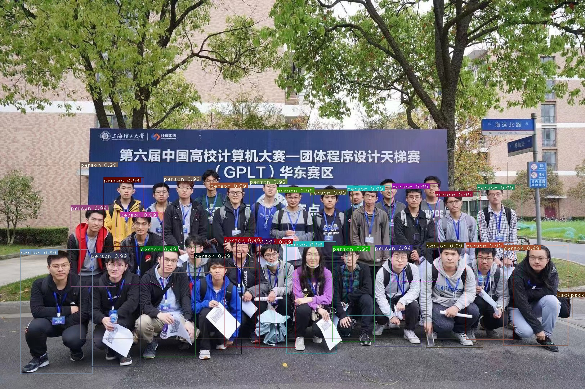

# YOLO-v3-implementation


EXAMPLE : SHU ACM CLUB

Source : https://arxiv.org/abs/1804.02767v1


Put pictures in folder images and simple run 

```python
python3 detector.py --images images --det det
```

or you can just give the path to the signle picture
```python
python3 detector.py --images single_root --det det
```


You will find detection in folder det 😺
